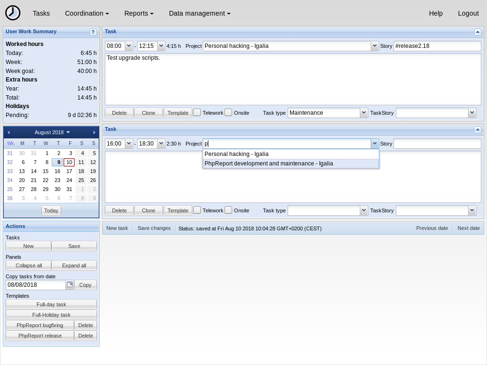
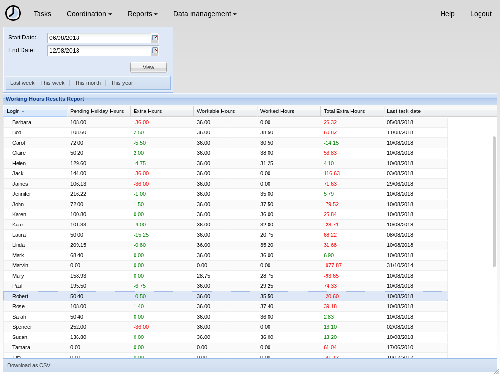
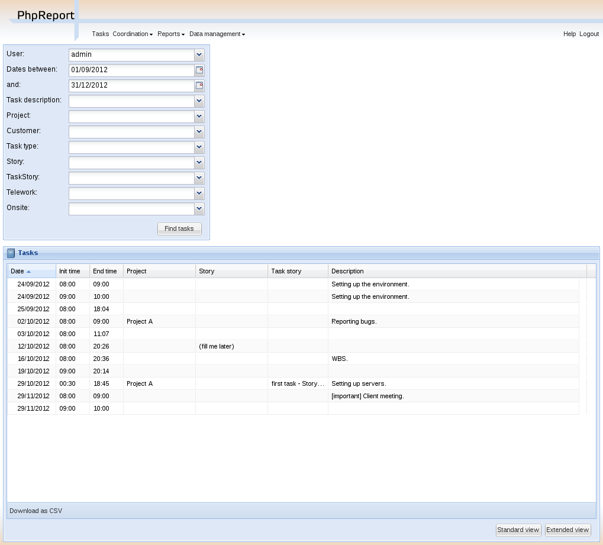

# PhpReport

PhpReport is a web application for time tracking, which provides useful
statistics about users, projects, and more.

The application is focused on companies or any situation where multiple people
collaborate on a project. PhpReport allows managers to see project-level
statistics such as cost and deviation, as well as user-level statistics like
number of days worked and unused vacation days. In addition, it also includes
tools for scheduling projects using extreme programming (XP) methodologies.

PhpReport makes use of the framework Ext JS to provide a rich user interaction
with the web application.

Finally, PhpReport can communicate with external applications, like ERPs or
desktop tools for personal time-tracking, by means of plugin development or
through the exposed web services.

## Get PhpReport

Download PhpReport from our
[releases page](https://github.com/Igalia/phpreport/releases).

Then follow the instructions in the [administrator manual](docs/admin/index.rst)
to install it or to upgrade from an earlier release.

## Documentation

There is documentation for users and system administrators, it comes packaged
with every release. Additionally, there is documentation intended for developers
in the project repository, together with the latest version of user and admin
documents:

* [User manual](docs/user/index.rst)
* [Administrator manual](docs/admin/index.rst)
* [Developer documentation](docs/developer/index.rst)

## More information 

* News: Take a look at the
[project blog](http://blogs.igalia.com/jaragunde/category/web/phpreport/).

* Development: Project sources, documentation and issue tracker are
available at [GitHub](https://github.com/Igalia/phpreport).

* Contact: For questions about the project, you can join the IRC channel
[#phpreport at FreeNode](http://webchat.freenode.net/?channels=#phpreport), or
contact directly with its [maintainer](https://github.com/jaragunde).

## License

The project is released under the
[GNU General Public License, version 3](COPYING).

## Screenshots

