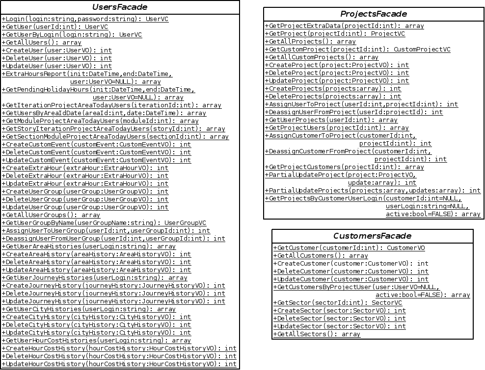

Business logic layer and plugin system
######################################

Purpose
=======

This layer implements the busienss logic of the application and exposes it as
a set of operations grouped in Facade objects.
In its design we have used the patterns
`Facade <https://en.wikipedia.org/wiki/Facade_pattern>`__ and
`Business Delegate <https://en.wikipedia.org/wiki/Business_delegate_pattern>`__,
in addition to `Singleton <https://en.wikipedia.org/wiki/Singleton_pattern>`__,
and `Template Method <https://en.wikipedia.org/wiki/Template_method>`__.

Business logic layer design
===========================

The *XXFacade* classes expose the interface of the business logic layer. Each
one of them consists in a grouping of logically related use cases, where each
use case is a method. We are not interested in the existence of different
implementations of the business logic, therefore the *Facade* classes are
Singleton with a concrete implementation. Find below an example with some of
these classes:

However, the implementation of the logic does not reside in the interior of the
methods of the facades, but it is delegated in the hierarchy of *Action* classes
There exists a *XXAction* class for every method of in the facade, which
implements the logic of that particular use case. The role of the methods in the
facades is instantiate the corresponding action object, execute it and return
its results. This relation is shown in the next diagram:

.. figure:: i/Facade-and-action.png

The *Action* classes are an implementation of the Bussiness Delegate pattern.
They implement the business logic of the application model of while hiding it to
client code that uses it.

Plugin system
=============

The diagram below shows in detail the implementation of an *Action* class. In
our design, they do not simply implement the business logic, but they also
provide the support for plugins, code blocks which are added before or after the
execution of a task in the business logic.

.. figure:: i/Action.png

The *Action* class only has one public method called *execute()*, which is the
only entry point to the code of the operation. Its children classes, one per
operation in the business logic, redefine the template method *doExecute()*,
where they actually implement the task. The reason for the existence of these
two separate operations is that *execute()* also takes care of the management
and execution of any plugins associated to its action.
The process is detailed in the next diagram:

.. figure:: i/Action-sequence.png

According to the sequence diagram, when the method *execute()* in
*CreateUserAction* is called, it makes a call to the
*ConfigurationParametersManager* to check if that action has any associated
plugins that should be previously run. As the result is negative, it continues
and runs *doExecute()*, which actually implements the user creation. Once it has
finished, if checks if there is an associated plugin to be run after the action,
and finds one called *EmailAdminPlugin*. In this moment, the class is loaded and
instanced, and its *run()* method is called.

Configuration variables are used to enable the execution of plugins, hence the
dependency between the *Action* class and the *ConfigurationParametersManager*
The name of the configuration variables that control the plugins for a particular
action is stored in the attributes *preActionParameter* and
*postActionParameter*, which are defined in the *Action* class their value set
in the child classes.
