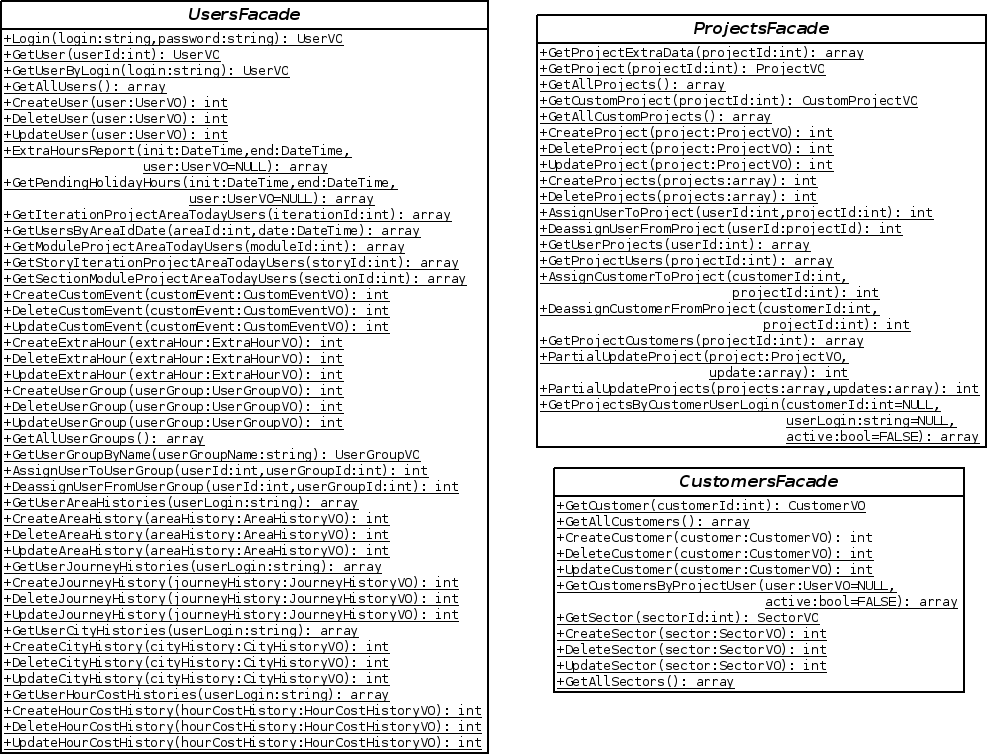
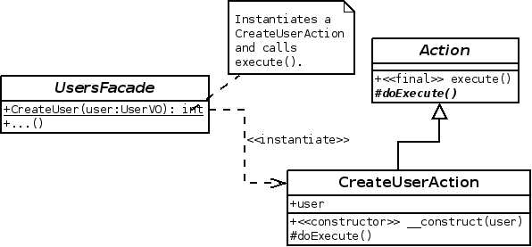
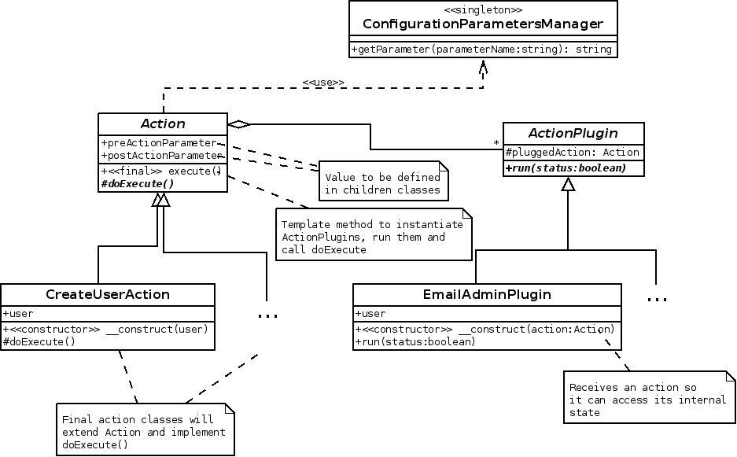
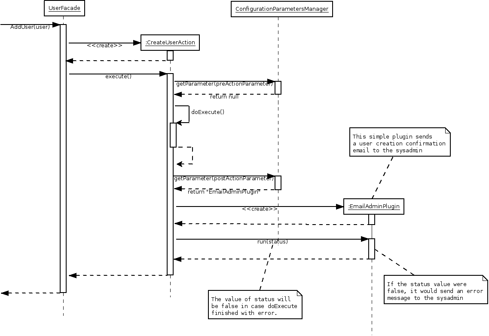

# Business logic layer and plugin system

## Purpose

This layer implements the busienss logic of the application and exposes
it as a set of operations grouped in Facade objects. In its design we
have used the patterns
[Facade](https://en.wikipedia.org/wiki/Facade_pattern) and [Business
Delegate](https://en.wikipedia.org/wiki/Business_delegate_pattern), in
addition to
[Singleton](https://en.wikipedia.org/wiki/Singleton_pattern), and
[Template Method](https://en.wikipedia.org/wiki/Template_method).

## Business logic layer design

The *XXFacade* classes expose the interface of the business logic layer.
Each one of them consists in a grouping of logically related use cases,
where each use case is a method. We are not interested in the existence
of different implementations of the business logic, therefore the
*Facade* classes are Singleton with a concrete implementation. Find
below an example with some of these classes:

However, the implementation of the logic does not reside in the interior
of the methods of the facades, but it is delegated in the hierarchy of
*Action* classes There exists a *XXAction* class for every method of in
the facade, which implements the logic of that particular use case. The
role of the methods in the facades is instantiate the corresponding
action object, execute it and return its results. This relation is shown
in the next diagram:

The *Action* classes are an implementation of the Bussiness Delegate
pattern. They implement the business logic of the application model of
while hiding it to client code that uses it.

## Plugin system

The diagram below shows in detail the implementation of an *Action*
class. In our design, they do not only implement the business logic, but
they also provide the support for plugins, code blocks which are added
before or after the execution of a task in the business logic.

The *Action* class has one public method called *execute()*, which is
the only entry point to the code of the operation. Its children classes,
one per operation in the business logic, redefine the template method
*doExecute()*, where they actually implement the task. The reason for
the existence of these two separate operations is that *execute()* also
takes care of the management and execution of any plugins associated to
its action. The process is detailed in the next diagram:

According to the sequence diagram, when the method *execute()* in
*CreateUserAction* is called, it makes a call to the
*ConfigurationParametersManager* to check if that action has any
associated plugins that should be previously run. As the result is
negative, it continues and runs *doExecute()*, which actually implements
the user creation. Once it has finished, if checks if there is an
associated plugin to be run after the action, and finds one called
*EmailAdminPlugin*. In this moment, the class is loaded and instanced,
and its *run()* method is called.

Configuration variables are used to enable the execution of plugins,
hence the dependency between the *Action* class and the
*ConfigurationParametersManager* The name of the configuration variables
that control the plugins for a particular action is stored in the
attributes *preActionParameter* and *postActionParameter*, which are
defined in the *Action* class their value set in the child classes.
