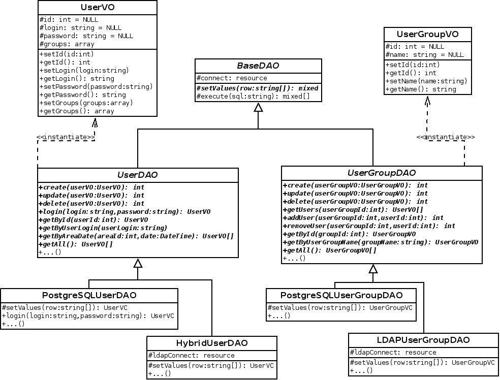
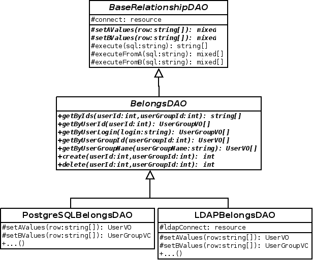
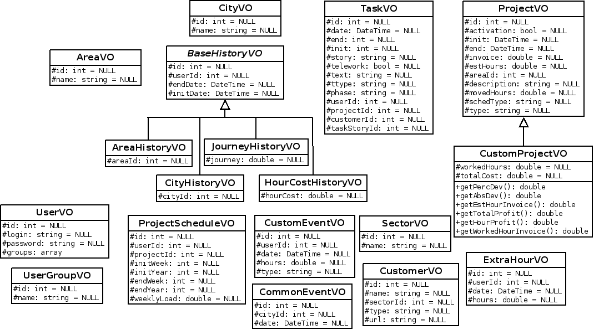
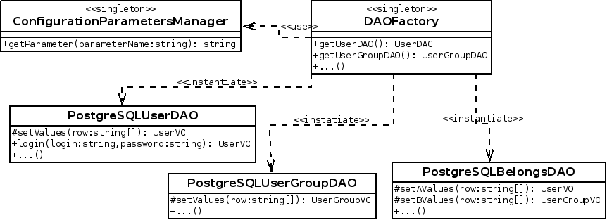
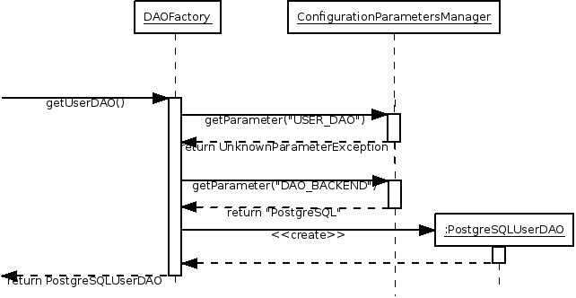

# Data access layer

## Purpose and design

The _data access layer_ is in charge of the transformation between the
data stored in persistence and the objects that are treated by the
application. In its design we have used the patterns [Data Access Object
(DAO)](https://en.wikipedia.org/wiki/Data_access_object) and [Value
Object (VO)](https://en.wikipedia.org/wiki/Value_object), in addition to
[Singleton](https://en.wikipedia.org/wiki/Singleton_pattern), [Template
Method](https://en.wikipedia.org/wiki/Template_method) and [Abstract
Factory](https://en.wikipedia.org/wiki/Abstract_factory).

## DAO design

The following two figures show the structure of three DAOs and the
classes related with them. They are the model for any DAOs in the
system; there are two hierarchies of DAOs: those that extend _BaseDAO_,
which define the operations on tables that represent entities, and those
that extend _BaseRelationshipDAO_, which define the operations on tables
that represent relations.

In both hierarchies there are three levels of inheritance:

- The first level contains the parent classes for all the DAOs of a
  certain type.
- In the second level is composed by abstract classes, one per table
  in the DB, that define the operations on that table.
- In the third level there are implementation details for specific
  different DB management systems.

Starting by the first level of inheritance, see that the class _BaseDAO_
defines two template methods, _setValues_ and _execute_, whereas the
class _BaseRelationshipDAO_ defines some more: _setAValues_,
_setBValues_, _executeFromA_ and _executeFromB_. They are used to be
able to implement some DB operations in a generic way, leaving the
specific parts of the DB manager isolated inside these functions, which
will be implemented in a lower level of the hierarchy.

The classes in the second level of inheritance group the operations on
each table of the DB. There is one class per table, and contains quite a
lot of methods; some implement CRUD operations (create, update and
delete), others run queries on the table in function of diverse
parameters, and others are entity-specific operations, like _login_ for
the entity _User_ or add and delete users from a group in _UserGroup_.

In the third level of inheritance, template methods for DB-specific
operations are implemented, in addition to those methods that have some
dependency on the DB management system. For example, the operation
_login_ uses an encryption function specific to PostgreSQL, therefore it
is implemented in _PostreSQLUserDAO_.

## VO design

Value Objects, from now on VOs, are object representations of tuples in
the DB. There is a VO class for every table that contains all its
attributes, together with getter/setter methods to manipulate them.
These objects are usually instantiated in the DAO as a result of a
query, although they also can be instantiated in upper layers with the
purpose of running a DAO creation operation.

The figure above shows all the VOs of the application. Most of them are
implemented only with one class, although there are some special cases.
On the one hand, we have the _BaseHistoryVO_ hierarchy, an abstract
class grouping a set of attributes, together with their access methods,
that are common to several VOs. On the other hand, we have the
_CustomProjectVO_ class, which extends _ProjectVO_ with a set of
additional attributes. These attributes do not directly correspond with
any data of the DB, but they are calculated in base to one or several of
the basic attributes of projects and related entities. The calculations
are done when the _CustomProjectVO_ is instantiated in the corresponding
operation of the projects DAO, and their results are destroyed when the
custom object is destroyed; they are never stored in the persistence
layer. The additional attributes in the custom object are interesting
for several project data visualisation screens, and is a good idea to
implement the algorithm for their calculation in one point of the
application model layer.

## DAO factory

To ensure the independence between the specific implementation of DAOs
and the upper layers of the application, DAOs are instantiated through
the _DAOFactory_ singleton class. This class has methods to get
instances of any DAO, and is albe to select the suitable implementation
of each DAO in run time from the content of application configuration
file. To access the configuration file it uses the class
_ConfigurationParametersManager_.

The figure below illustrates the design of this class and its main
relations:

### DAO implementation configuration

There are two ways to configure the specific implementation of DAOs. In
the application configuration file, there is a parameter to define the
implementation to be used as a general case, while there is an
individual parameter for every DAO that allows to replace its specific
implementation independently from the rest of them. The _DAOFactory_
object is the one that manages this logic, according to the next
sequence diagram:

This feature supports the implementation of LDAP authentication support
and can be used to implement certain scenarios of integration with
external services, for example, integrate an external calendar service
to supply work calendars.
