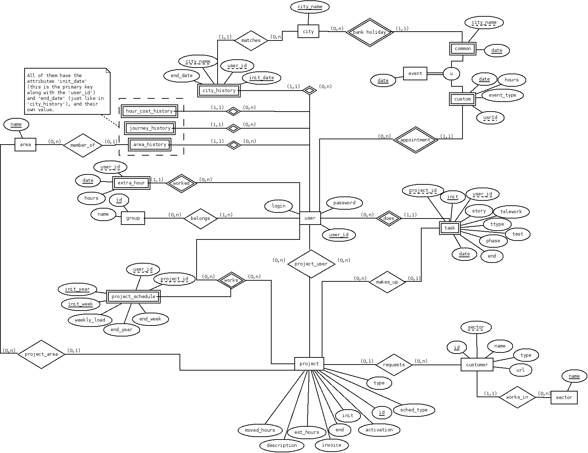

# Data model

## Design

The next diagram shows the theoretical vision of the data model, in
which the best practices related with the normalisation of the data have
been followed. However, the implementation contains a change that
contravenes these norms: the original primary keys of all the entities
have been replaced by numerical identifiers acting as keys. The reasons
of this change are, on the one hand, efficiency, avoiding the keys
formed by multiple attributes. On the other hand, convenience, since
these numerical keys can be autogenerated by the database. Besides,
numeric ids can be used to keep a reference between database objects and
external objects, for example, objects in a client application.

To describe in brief the model of data, we will mention the most
important entities and relations:

- The entity _task_ could consider the main object of the application,
  since the main purpose of PhpReport is to store, classify and
  extract information about tasks. It has important relations with
  _user_ and _project_, that serve to classify the task.
- The entity _user_ is used mainly to control the access to the
  application, besides classifying tasks. There is a series of
  entities related with user that provide valuable information when
  they combine : the relations with _event_, _city_history_,
  _journey_history_ do calculations on the working time, and
  _hour_cost_history_ on the cost.
- The entity _project_ is used to classify and group tasks. It is
  interesting to mention the relation called _works_ with _user_,
  which could be used to restrict the access to certain information in
  the application.
- The entity _customer_ classifies projects.
- The entity _sector_ classifies customers.
- The entity _area_ classifies projects and users. The relation
  between areas and users happens through the entity _area_history_
  which stores the history of that user belonging to areas.
- The entity _group_ defines levels of access in the application.
- The entity _extra_hour_ is used to reset the calculation of extra
  hours of an user in a determinate date.
- The entity _event_ provides basic support for work calendars. It
  stores a list of dates which are considered non work days in a
  certain city.
- The entity _city_ represents the city to which the worker is or has
  been assigned, through _city_history_.

There are entities related with unimplemented features:

- _Project_schedule_ to define project weekly schedules.
- _Custom_ events to define personal work calendars, independently
  from per-city calendars.
