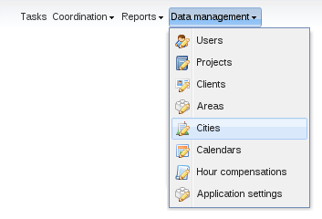
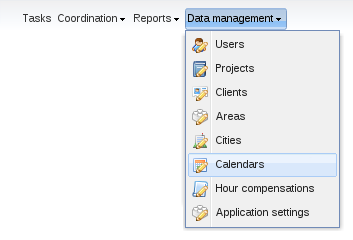

# Cities and work calendars management

PhpReport provides interfaces to create, edit and remove cities and the
calendars attached to them.

## Create, edit and delete cities

In the _Cities management_ screen you will be able to create, edit and
delete cities. It can be accessed from the _Data management_ menu,
section _Cities_.

This interface consists of a grid containing the list of cities stored
in the system, sorted by _name_.

To create a new city you must use the _Add_ button located above the
grid, and to edit a city you must double-click on the corresponding row.
In both cases, an inline edition row will appear; the only editable
field is the name of the city.

To delete a city you must select it with a single click on the
corresponding row and use the _Delete_ button located next to _Add_
button. You will be asked for confirmation before actually trying to
delete. If the city is assigned to some user, or if you have added any
days to its calendar, you won't be allowed to delete it. You have to
remove these associated data and try the deletion later.

## Work calendars management

In the _Calendars management_ screen you will be able to select the
public holidays associated to every city. It can be accessed from the
_Data management_ menu, section _Calendars_.

In this screen you will see a big calendar, and two small selectors on
the side, together with the save button.

First of all, you have to select a city among the ones present in the
system, using the combo box on the left side. Then you should select a
year in the text box below, by default the current year is set.

To add public holidays you only have to click on the days directy on the
calendar. Clicking again on an already selected day will remove it. When
you are done, press the _Save_ button located on the left side.

If you change the selected city, any unsaved changes will be lost, but
the application will warn you before letting it happen. On the other
hand, you can change the selected year without fear of losing the
changes.
