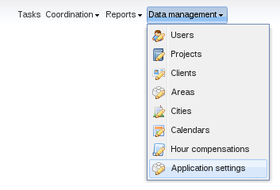
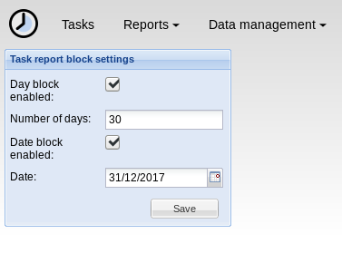

# Settings management

PhpReport provides a web interface to configure some system-wide
settings. It can be accessed from the _Data management_ menu, section
_Settings_.

This is how the _Settings management_ screen looks like:

## Task report block settings

Task reporting can be blocked depending on the selected date. There are
two ways to configure how far in the past users are allowed to enter new
tasks or to edit existing ones. They work independently, and the most
restrictive of them will always apply.

There are four settings to configure this feature:

Day block enabled:

: If checked, task reports for dates older than a certain number of
days cannot be modified. You will have to set the following value
for this setting to work.

Number of days:

: The number of days in the past to activate the block. The minimum
value is 1, which would block the day before the current date.
Setting it to 0 or leaving it empty would disable the feature.

    For example, setting this value to seven will prevent users from
    entering tasks older than a week.

Date block enabled:

: If checked, dates before the selected date are locked. You will have
to set the following value for this setting to work.

Date:

: If date block is enabled, tasks on this date or older than that
cannot be edited.

    For example, setting this value to 31/12/2017 will prevent users
    from modifying tasks in 2017 or earlier.
