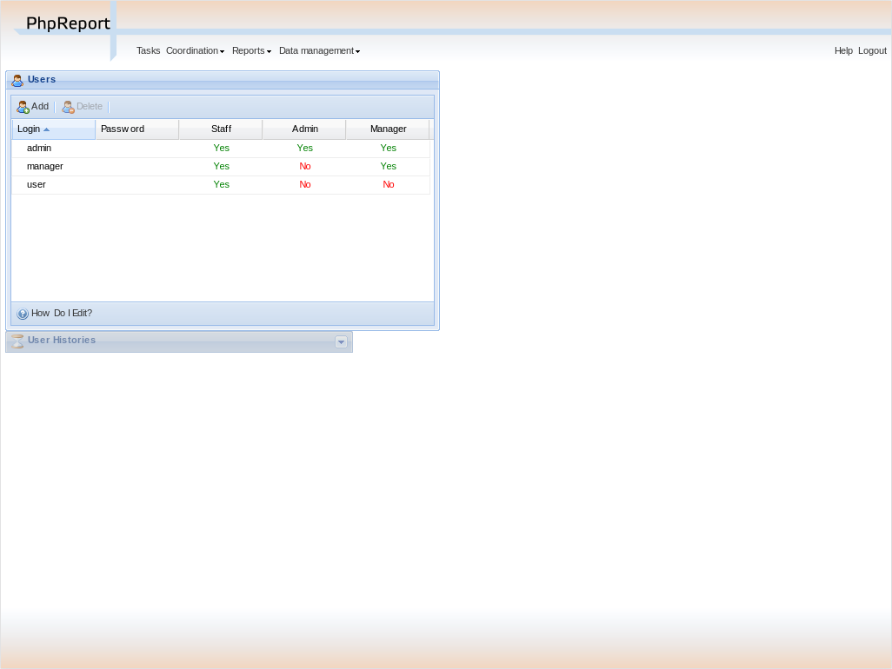
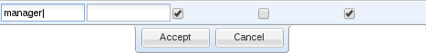
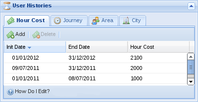
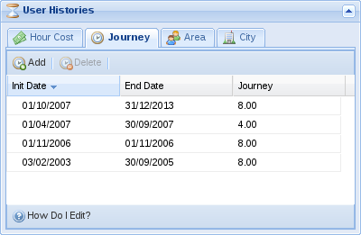
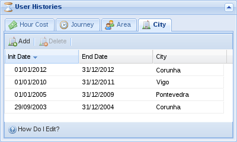

# Users management

PhpReport provides an interface to create, edit and remove users, and
assign their hour cost, journey, area membership and city residence
data. It can be accessed from the _Data management_ menu, section
_Users_.

## Create, edit and delete users

In the _Users management_ screen you will see a grid containing all the
users, sorted by _login_ by default; this can be changed pressing on the
corresponding column.

To create a new user you must use the _Add_ button located above the
grid, and to edit an existing user you must double-click on the
corresponding row.

In both cases, the following inline edition row will appear:

In the row you must enter the data of the user:

Login:

: User name, to be used in the login screen and to appear in the
reports.

Password:

: Password to be used in the login screen.

Staff:

: Belonging to the staff group. Activating it the user will be able to
login, fill tasks in and check some reports. In particular, they
will have access to _User tasks_, _User details_, _Accumulated
hours_ and _Project details_, only of those projects they are
assigned to.

Manager:

: Belonging to the manager group, users will have access to all kinds
of reports, as well as using the _User_ filter in the _User tasks_
report to chose any other user.

Admin:

: Belonging to the administrators group. Activating it the user will
be able to use the screens under _Data management_ section: manage
projects, users, etc.

Permission levels are meant to be stacked; e.g. it doesn't make sense
to have a _Manager_ user that doesn't belong to the staff group too.

::: tip
::: title
Tip
:::

If LDAP authentication is set, you won't be able to edit these user
data. Besides, columns _Staff_ and _Admin_ may not appear, and the names
of the groups in the LDAP server would appear instead.
:::

To delete a user you must select it with a single click on the
corresponding row and use the _Delete_ button located next to _Add_
button. You will be asked for confirmation before actually trying to
delete. Users who have been assigned to some project, or who have
already entered some tasks, won't be allowed to be deleted. You have to
remove existing assignations or tasks and try the deletion later.

## Setting the hour cost for a user

The hour cost for a user will be used to calculate the _Total cost_ for
a project, taking into account the time every user has contributed to
that project. The total cost of a project can be checked in the _Project
evaluation_ report.

Hour cost may vary with time, so you will have to enter an _Init date_
and _End date_ for every value of hour cost in PhpReport. You can do it
in the _Users management_ screen, selecting one user (doing a single
click on a row) and expanding the panel named _User Histories_ located
below the users grid. The first tab in this panel corresponds to _Hour
Cost_:

As you can see, every row has three values: _Init date_, _End date_ and
_Hour Cost_. To create a new row, you must use the _Add_ button, and to
edit a row you must double click on it. In both cases an inline edition
row will appear and you will be able to enter the three values. Once you
have entered them you can _Accept_ to save the changes. To delete a row
you must select it with a single click and use the _Delete_ button.

::: warning
::: title
Warning
:::

Overlapping time periods among different rows are not allowed.
:::

## Setting the journey for a user

The journey is the number of hours the person is supposed to work for
every working day. Working days in PhpReport are Monday to Friday. This
value will be used to calculate the balance of _Extra hours_ for a user,
as well as the corresponding amount of _Holiday hours_. These values can
be checked in the [Accumulated hours](reports.md#accumulated-hours)
report.

This value may vary with time (e.g. a user may change from full time to
part-time dedication for a specific period of time), so you will have to
enter an _Init date_ and _End date_ for every value of user journey in
PhpReport. You can do it in the _Users management_ screen, selecting one
user (doing a single click on a row) and expanding the panel named _User
Histories_ located below the users grid. The second tab in this panel is
_Journey_:

As you can see, every row has three values: _Init date_, _End date_ and
_Journey_. To create a new row, you must use the _Add_ button, and to
edit a row you must double click on it. In both cases an inline edition
row will appear and you will be able to enter the three values. Once you
have entered them you can _Accept_ to save the changes. To delete a row
you must select it with a single click and use the _Delete_ button.

::: warning
::: title
Warning
:::

Overlapping time periods among different rows are not allowed.
:::

## Setting the area for a user

Areas are the way to translate a department structure to PhpReport; you
can assign a user to an area for a defined period of time. Like in the
previous values, you will have to enter an _Init date_ and _End date_
for every value of user area in PhpReport. You can do it in the _Users
management_ screen, selecting one user (doing a single click on a row)
and expanding the panel named _User Histories_ located below the users
grid. The second tab in this panel is _Area_:

As you can see, every row has three values: _Init date_, _End date_ and
_Area_. To create a new row, you must use the _Add_ button, and to edit
a row you must double click on it. In both cases an inline edition row
will appear and you will be able to enter the three values. Once you
have entered them you can _Accept_ to save the changes. To delete a row
you must select it with a single click and use the _Delete_ button.

::: warning
::: title
Warning
:::

Overlapping time periods among different rows are not allowed.
:::

## Setting the city for a user

Users may be assigned to a city. The city has influence in the working
days of users, because they translate the public holidays of every city
to user hours accountability. Public holidays work like weekends: users
are not supposed to work in those days, and when they do, the hours are
accounted as extra hours.

This value may vary with time (e.g. a user moving to a work center
located in a different city), so you will have to enter an _Init date_
and _End date_ for every value of user city in PhpReport. You can do it
in the _Users management_ screen, selecting one user (doing a single
click on a row) and expanding the panel named _User Histories_ located
below the users grid. The second tab in this panel is _City_:

As you can see, every row has three values: _Init date_, _End date_ and
_City_. To create a new row, you must use the _Add_ button, and to edit
a row you must double click on it. In both cases an inline edition row
will appear and you will be able to enter the three values. Once you
have entered them you can _Accept_ to save the changes. To delete a row
you must select it with a single click and use the _Delete_ button.

::: warning
::: title
Warning
:::

Overlapping time periods among different rows are not allowed.
:::

## Setting user custom goals

Goals are used to fulfil specific accumulated hour goals per user in a
specific period of time. Every goal will have _Init date_, _End date_
and _Extra hours_: dates actually refer to the week they belong, e.g.
setting _Init date_ to Monday or Thursday of the same week makes no
difference; the _Extra hours_ field is the number of accumulated hours
that a user must have in the specified period to fulfill the goal, it
should be equal to the value of worked hours minus workable hours
between Monday of the init date week and Sunday of the end date week.

The weekly goal value in the [User work
summary](tasks.md#user-work-summary) shows how many hours they should
work every week to fulfil their goal when they reach the end date. The
value will vary every week according to how far or close they are to
fulfill their goal.

When no custom goal is set, users will get a default goal. The default
goal starts on the beginning of the year, on the user journey start date
or on the end date of a previous custom goal, whatever is more recent;
it ends at the end of the year, the end of the journey or the beginning
of a future custom goal, whatever is closer in time. The extra hours
value of the default goal is 0. For the most common cases, a default
goals is equivalent to setting 1st Jan as init date, 31st Dec as end
date and 0 as extra hours.

## Filling long leave periods for absent users

Sometimes, an admin needs to fill long periods of sick leave or other
kinds of leaves for an absent user. There is an interface to accomplish
this, it can be accessed from the _Data management_ menu, section _Long
leaves_.

You need to fill in the following data:

Type of leave:

: The project the leave will be assigned to. To have projects listed
here, they need to have been saved with the project type \"leave\"
in the [Projects management](projects-management.md) area.

User:

: User the leave will be assigned to.

Start and end dates:

: When the leave will start and end. One task will be created for
every day between those dates, excluding weekends.

Description:

: Optional text to be added in the task description.

::: warning
::: title
Warning
:::

Make sure the details are correctly filled as there is no interface to
remove multiple leaves at once.
:::
