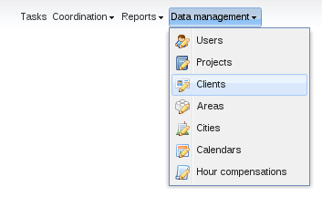
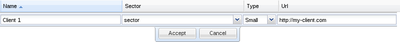

Clients management
==================

::: {.contents}
:::

PhpReport provides an interface to create, edit and remove clients. It
can be accessed from the *Data management* menu, section *Clients*.

Create, edit and delete clients
-------------------------------

In the *Clients management* screen you will see a grid containing all
the clients stored in the system, sorted by *name* by default; this can
be changed pressing on the corresponding column. Below the grid with the
clients there is another grid containing the list of *sectors* in the
system, explained later.

To create a new client you must use the *Add* button located above the
grid, and to edit a client you must double-click on the corresponding
row.

In both cases, the following inline edition row will appear:

In the row you must enter the data of the user:

Name:

:   Name of the client.

Sector:

:   Sector the client belongs to. To be selected among one of the
    sectors in the list.

Type:

:   Another field to classify the clients. Values are *small*, *medium*
    and *large*.

Url:

:   An optional URL pointing to the website of the client.

To delete a client you must select it with a single click on the
corresponding row and use the *Delete* button located next to *Add*
button. You will be asked for confirmation before actually trying to
delete. If the client is assigned to some project you won\'t be allowed
to delete it. You have to remove the existing assignations from projects
or tasks to this client and try the deletion later.

Create, edit and delete sectors
-------------------------------

In the *Clients management* screen you will also be able to maintain a
list of *Sectors*, which are a grouping field for clients. There can be
any number of sectors, and their names are editable. They can be
created, edited or deleted using the grid below the one with the
clients.

To create a new sector you must use the *Add* button located above the
grid, and to edit a sector you must double-click on the corresponding
row. In both cases, an inline edition row will appear; the only editable
field is the name of the sector.

To delete a sector you must select it with a single click on the
corresponding row and use the *Delete* button located next to *Add*
button. You will be asked for confirmation before actually trying to
delete. If the sector is assigned to some client you won\'t be allowed
to delete it. You have to remove the existing assignations to clients
and try the deletion later.
