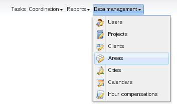
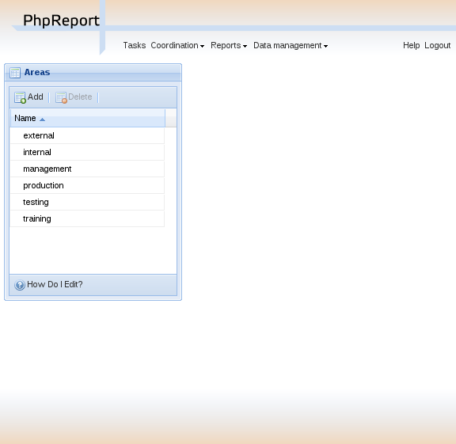
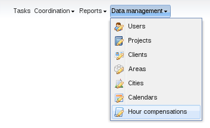
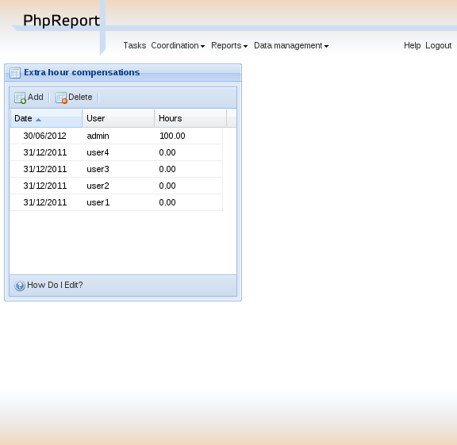

Management of other entities
============================

::: {.contents}
:::

There are some other entities in PhpReport, not mentioned before, with
their own management interfaces.

Create, edit and delete areas
-----------------------------

In the *Areas management* screen you will be able to create, edit and
delete areas. It can be accessed from the *Data management* menu,
section *Areas*.

This interface consists of a grid containing the list of areas stored in
the system, sorted by *name*.

To create a new area you must use the *Add* button located above the
grid, and to edit an area you must double-click on the corresponding
row. In both cases, an inline edition row will appear; the only editable
field is the name of the area.

To delete an area you must select it with a single click on the
corresponding row and use the *Delete* button located next to *Add*
button. You will be asked for confirmation before actually trying to
delete. If there are any users or projects assigned to that area, you
won\'t be allowed to delete it. You have to remove these associations
and try the deletion later.

Create, edit and delete extra hours compensations
-------------------------------------------------

In the *Hour compensations management* screen you will be able to
create, edit and delete extra hours compensations. It can be accessed
from the *Data management* menu, section *Hour compensations*.

This interface consists of a grid containing the list of areas stored in
the system, sorted by *date*.

To create a new compensation you must use the *Add* button located above
the grid, and to edit a compensation you must double-click on the
corresponding row. In both cases, an inline edition row will appear,
where you can edit the fields *date*, *user* and *hours*.

To delete a compensation you must select it with a single click on the
corresponding row and use the *Delete* button located next to *Add*
button. You will be asked for confirmation before actually trying to
delete.
