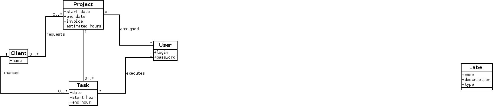

# Overview

PhpReport is an open source web application for time tracking, focused
both on project control and working day management. It tries to provide
useful data for workers and managers about the way time is devoted to
projects.

## Data model for time tracking

The core purpose of PhpReport is being able to track the time devoted to
work by members of an organization, and which part of that time is
devoted to every running project. The core of the time tracking revolves
around these four entities:

- Task entity represents a task performed by a user in a date, with a
  determinate length stored in its start and end time.
- User entity represents a user of the system, who is meant to be a
  member of the organization being tracked. Every member is supposed
  to be working and tracking their hours in the system.
- Project entity represents a project, a common goal for a set of
  tasks.
- Client entity represents an organization who requests a project.

The relations stablished between them are the following:

- Every task belongs to one user; users can execute any number of
  tasks.
- Users are assigned to projects, with no constraints of number of
  users or projects.
- Every task belongs to one project; projects can have any number of
  tasks.
- Clients request projects; a client can request more than one project
  but each project is requested only by one client.

## Data model for working day management

PhpReport can calculate the number of hours users are supposed to work
and track the balance of extra or undone hours. It can also take into
account public holidays to do that calculation. These are the new
entities introduced with this purpose:

- City entity represents a city, because public holidays are usually
  set at city level.
- Public holiday entity represents one public holiday which belongs to
  one city.
- City history entity represents the history of cities to which a user
  has belonged, between two dates.
- Journey history entity represents the number of hours a user is
  supposed to work per working day between two dates. PhpReport
  considers there are five working days per week, from Monday to
  Friday, excepting public holidays.
- Extra hour compensations entity represents a moment in time where
  the calculation of extra hours for a particular user is reset to a
  new figure, ignoring all the previous history.

Relations between these entities:

- A user can have any number of associated city history entities, as
  long as the time periods of these history entities don't overlap.
- In the same way, a user can have any number of associated journey
  history entities, fulfilling the same condition about overlapping.
- One city history entity can only be related to one city, as a
  consequence a user can't be member of multiple cities at the same
  time.
- Finally, a city can have any number of public holiday entities. One
  public holiday entity can only be related with one city, so if the
  same date is a holiday in different cities there must be two
  entities with the same date but different relations.
- A user can be associated with any number of extra hours compensation
  entities.

## Data model for project cost management

PhpReport can estimate the cost, deviation, benefit and other economical
data of your projects. The related entities are:

- User, Project and Task entities, already introduced.
- Hour cost history entity, it represents the history of the cost per
  hour for a user in different time periods.

This is the explanation of the relations stablished between these
entities:

- A user can have any number of associated hour cost history entities,
  as long as the time periods don't overlap.
- The application can know the number of hours devoted to a project by
  every user, through the relation with task entity and its relation
  with project entity. Using the date of the tasks and the relation
  with hour cost history, the cost of every work hour can be
  calculated.

## Data model for organization structure

PhpReport structures the organization in areas, to which users and
projects belong. This is a breakdown of the related entities:

- User and Project entities, already introduced.
- Area entity, it represent an area of interest inside the
  organization.
- Area history entity, it represents the history of the membership of
  a user to different areas.

Relations between these entities:

- A user can have any number of associated area history entities, as
  long as the time periods don't overlap.
- One area history entity can only be related to one area, as a
  consequence a user can't be member of multiple areas at the same
  time.
- Finally, a project belongs to only one area, while an area can have
  many projects.

## Data model for holiday management

PhpReport can also calculate the number of holiday hours corresponding
to every worker according to their contract and journey conditions.
Holidays are treated as tasks belonging to a specific project called
\"Holidays\". Users taking one day of holidays should fill a task
specifying that project, and with a number of hours equal to the length
of their working day (which is 8 hours by default).

The entities involved in this process are:

- A specific project called 'Holidays'.
- The Task entity, in this case represents used holidays.
- A configuration parameter called `YEARLY_HOLIDAY_HOURS`, it
  indicates the number of holiday hours corresponding to one person in
  a year having a journey of 8 hours per day. The default value is 184
  hours, which corresponds to 23 holidays per year. The application
  will adjust this value according to the specific case of every user,
  as specified below.
- Journey history entity is also involved in this calculation,
  adjusting the value of `YEARLY_HOLIDAY_HOURS` to the situation of
  every user. E.g. a user working 4 hours per day would have 92 hours,
  and a person working from January to June would have 92 hours too,
  assuming the default configuration.
