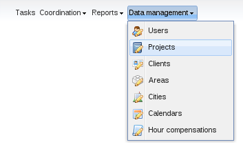
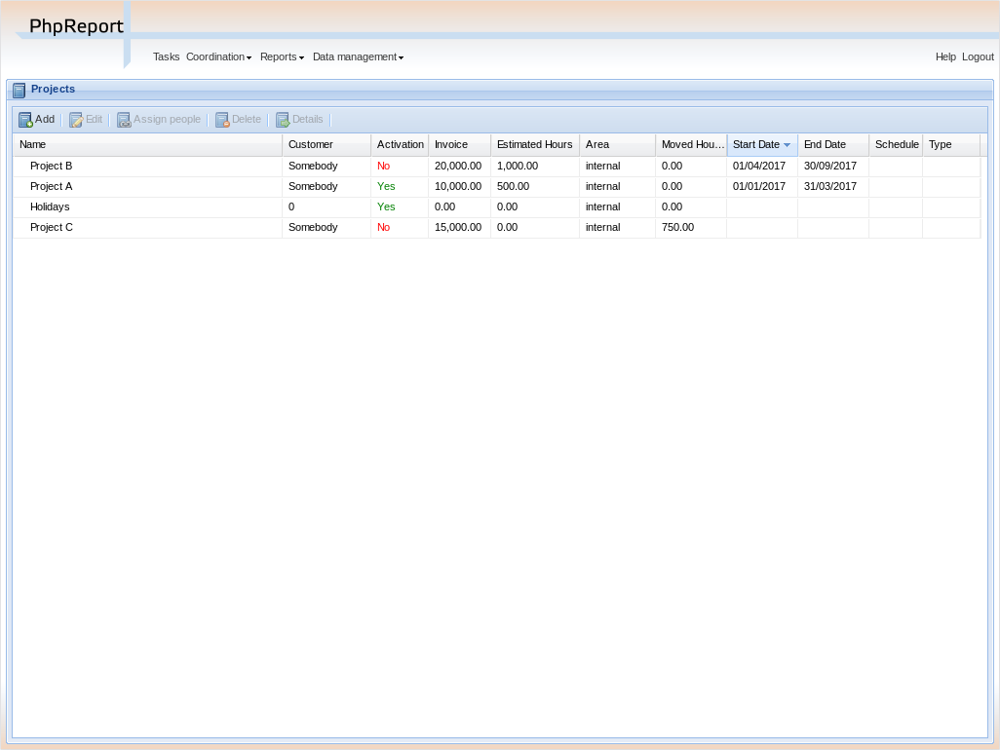
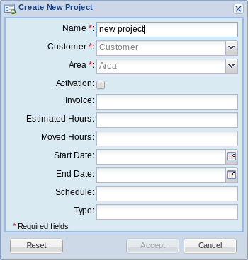
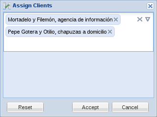
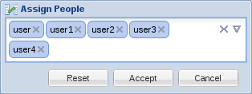

Projects management
###################

.. contents::

PhpReport provides an interface to create, edit and remove projects, and assign
them to users and clients. It can be accessed from the *Data management* menu,
section *Projects*.

Create, edit and delete projects
===================================

In the *Project management* screen you will see a grid containing all the
projects, sorted by *start date* by default; this can be changed pressing on
the corresponding column.

To create a new project you must use the *Add* button located above the grid,
and to edit a project you must double click on the corresponding row or click
once to select it and then press the *Edit* button, also located above the
grid.

In both cases, the following subwindow will appear:

In the window you must enter the data of the project:

Name:
  Name of the project.

Area:
  Area of the company this project belongs to.

Activation:
  Activation status of the project. If it's not active it doesn't appear in the
  tasks screen and no hours can be entered.

Invoice:
  Expected invoiced of the project.

Estimated hours:
  Number of hours expected to be devoted to the project.

Moved hours:
  Number of hours moved out of the project. The moved hours are not taken into
  account to calculate the deviation or the estimated invoice per hour.

Start date:
  Start date of the project.

End date:
  Theoretical end date of the project.

Schedule:
  Legacy field containing the type of schedule of the project. Now it can
  contain any text.

Type:
  Legacy field containing the type of the project. Now it can contain any text.

The *Reset* button allows you to to return the data in the window to the
original state, while the *Accept* and *Cancel* buttons will save or discard
your changes, respectively.

With the *Delete* button located above the projects grid you can remove the
selected project. You will be asked for confirmation before actually trying to
delete. If there are any assignations of tasks, clients or users to the project,
you won't be allowed to delete it. You have to remove those assignations and try
the deletion later.

Finally, the last button, *Details*, will open the
`project details report <reports.html#project-details>`__ for the selected
project.

Assigning clients
=================

To assign clients to the selected project, press the *Assign Client* button
located below the projects grid (in the bottom-right corner). The following
subwindow will appear:

To assign a client, you can open a dropdown box containing the full list of
clients pressing the down arrow icon on the right or type some letters of the
client name which will open a list of clients matching that name. Use your
mouse or your keyboard to select a client from the dropdown box and get it
added.

You can repeat this process any number of times you want, until all the
required clients have been added.

To remove one client, you can press the X button located inside every user box.
The X icon on the right side of the subwindow will clear the list.

Once you're done, press the *Accept* button to save the assignment or
*Cancel* to discard it. You can also use the *Reset* button to return the data
in the window to the original state.

Assigning users
=================

To assign users to the selected project, press the *Assign People* button
located below the projects grid (in the bottom-right corner). The following
subwindow will appear:

To assign a user, you can open a dropdown box containing the full list of
users pressing the down arrow icon on the right or type some letters of the
user name which will open a list of users matching that name. Use your
mouse or your keyboard to select a user from the dropdown box and get it
added.

You can repeat this process any number of times you want, until all the
required users have been added.

To remove one user, you can press the X button located inside every user box.
The X icon on the right side of the subwindow will clear the list.

Once you're done, press the *Accept* button to save the assignment or
*Cancel* to discard it. You can also use the *Reset* button to return the data
in the window to the original state.

