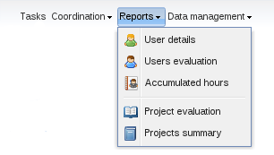
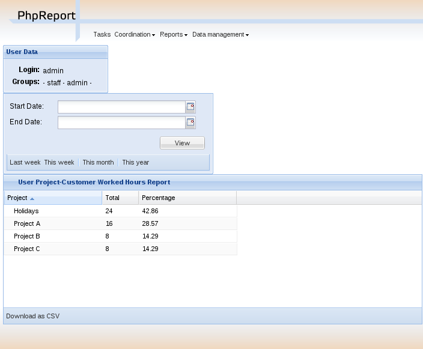
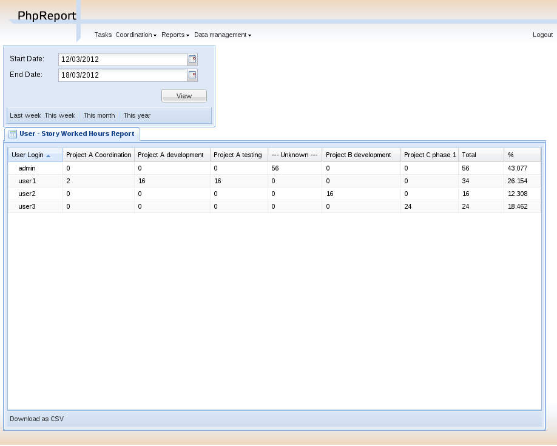
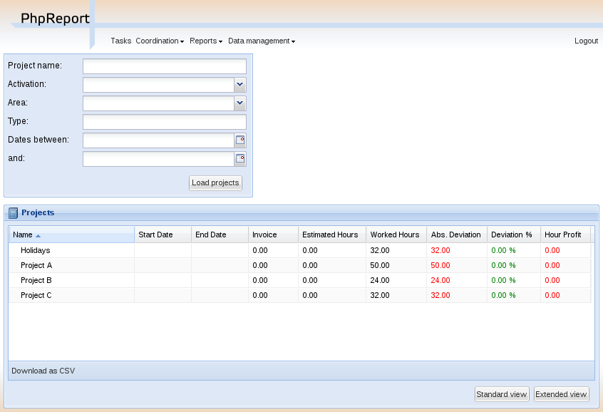
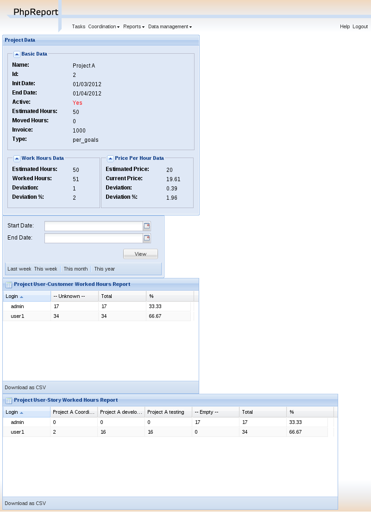
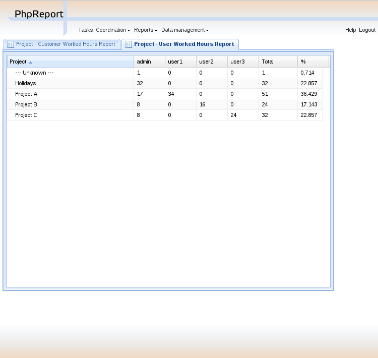

Reports
#######

.. contents::

PhpReport provides different reports to check the status of projects and users.
They can be accessed in the *Reports* menu.

User tasks
==========

.. figure:: i/user-tasks-screen.png

This report retrieves the list of tasks introduced by a user which match certain
conditions.

The top of the screen contains a box with all the available filters. In all
cases, leaving a field empty means that the field won't be taken into account.
This is the full list of available options:

User
  Filter tasks according to the user who input them. This is the only compulsory
  field, and it defaults to the current user. User with manager permissions are
  allowed to change it.

Dates between ... and ...
  Filter tasks according to their date. You can use only the first field to get
  the tasks since a particular date or only the second field to get the tasks
  saved before or at that date.

Task description:
  A text string can be set here to search it inside the description field of
  tasks. You can also select in a drop-down list the options **[empty]** or
  **[not empty]** to search the tasks that contain some text or no text in that
  field.

Project:
  You can filter the tasks assigned to a specific project selecting one from
  this list.

Customer:
  You can filter the tasks belonging to projects assigned to a specific customer
  selecting one from this list.

Task type:
  You can filter the tasks tagged with a specific task type selecting one from
  this list.

Story:
  A text string can be set here to search it inside the story field of
  tasks. You can also select in a drop-down list the options **[empty]** or
  **[not empty]** to search the tasks that contain some text or no text in that
  field.

TaskStory:
  You can filter the tasks related with a specific category inside a XP tracker
  iteration selecting one from this list.

Telework:
  You can filter the tasks tagged as telework or the opposite with this option.

Onsite:
  You can filter the tasks tagged as onsite or the opposite with this option.

The results are shown in the grid in the central area of the screen; rows
represent tasks and columns represent the different data stored in them.
You can export the data contained in the grid to a CSV file for processing with
spreadsheet software, for example, using the **Download as CSV** button at the
bottom of the grid.
Finally, at the bottom of the box containing the grid there are two buttons named **Standard view**
and **Extended view**. The first one hides some columns to show a more compact
grid (it's the default option), while the second one shows all the columns.

User details
============

This report details the work of the logged user between two dates. It shows the
time spent in every project.

The top of the screen contains two boxes with the available filters. This is
the full list of available options:

User
  Filter hours according to the user who input them. This is the only compulsory
  field, and it defaults to the current user. Users with manager permissions are
  allowed to change it.

Start and end dates
  Filter hours according to their date. If the start date is left empty, the
  default value is the date of the first task inserted by the user; if the end
  date is empty, the default value is the current date.

  There are quick-access buttons for common combinations of dates at the bottom
  of the dates box.

The results are shown in the grid in the central area of the screen; rows
represent projects and columns represent *Total* and *Percentage* hours.
The former shows the total number of hours invested in a project in the selected
time period and the latter shows the proportion of hours of one project regarding
all the work done by the user in the same time period.

You can export the data contained in the grid to a CSV file for processing with
spreadsheet software, for example, using the **Download as CSV** button at the
bottom of the grid.

User evaluation
===============

This report details the amount of work done by all the users in the system
between two dates. It shows the time spent by every user on each story.

In the top of the screen there are two date inputs to insert the report
dates: if the start date is left empty, the default value is the date of the
first task inserted by the user; if the end date is empty, the default value is
the current date.
There are quick-access buttons for common combinations of dates at the bottom
of the dates box.

The results are shown in the grid in the central area of the screen; rows
represent users and columns represent stories (the field *Story* of every task,
which we said it could be used to differentiate tasks). There are also two extra
columns, *Total* and *%*; the former shows the total number of hours invested in
a user, independently from the story (thus, it's the sum of all the story
columns) and the latter shows the proportion of hours of one user regarding
all the work done in the organization in that time period.

You can export the data contained in the grid to a CSV file for processing with
spreadsheet software, for example, using the **Download as CSV** button at the
bottom of the grid.

Accumulated hours
=================

.. figure:: i/acc-hours-screen.png

This report shows the difference of hours between every user's theoretical work
journey and the actual number of hours worked, and the number of unused holiday
hours. It shows the partial results between two dates and the total since the
beginning of the history.

PhpReport assumes a work journey of X hours per day from Monday to Friday, and
excluding public holidays. X is a variable that can be configured by managers
for every user, in the user management screen.

In the top of the screen there are two date inputs to insert the report
dates: if the start date is left empty, the default value is the date of the
first contract period of every user; if the end date is empty, the default value
is the current date.
There are quick-access buttons for common combinations of dates at the bottom
of the dates box.

The results are shown in the grid in the central area of the screen; rows
represent users and columns represent the following data:

Pending holiday hours:
  it's the difference between the theoretical number of
  holiday hours for every user (calculated according to the explanation in
  `Data model for holiday management <overview.rst#data-model-for-holiday-management>`__)
  and the number of holiday hours used. The unused holidays are accumulated from
  one year to the next one; to see only the number of pending holidays in the
  current year, a start date in the current year must be chosen.

Extra hours:
  the difference of hours between the actual number of hours worked and
  the theoretical work journey, inside the specified time interval. It's
  the difference between the columns 'Worked hours' and 'Workable hours'.

  Extra hour compensations are not taken into account when calculating the value
  of this column.

Workable hours:
  theoretical number of hours every user should have worked in
  the specified time interval.

Worked hours:
  actual number of hours every user has worked in
  the specified time interval.

Total extra hours:
  the difference of hours between the actual number of hours worked
  and the theoretical work journey, taking into account all the history of
  the worker until the specified end date. It can be used to check side by side
  the partial value in 'Extra hours' column and the absolute value in this
  column. If the start date of the report is left empty, the values of these two
  columns are the same.

  Extra hour compensations are taken into account when calculating the value of
  this column. If the user has any compensation entry the value of this column
  reflects the compensated value adding or subtracting the extra hours since the
  date the compensation became effective.

You can export the data contained in the grid to a CSV file for processing with
spreadsheet software, for example, using the **Download as CSV** button at the
bottom of the grid.

Project evaluation
==================

This report shows a list with projects and some data and statistics about them.
There are different filtering options to select the projects to be listed.

In the top of the screen there are different filtering options to be applied to
the list of projects. Leaving an option empty means not taking into account that
field. The options are:

Project name:
  The name of the project must contain the words entered here.

Customer name:
  The customer of the project must contain the words entered here.

Activation:
  Check whether the project is active or not.

Area:
  Only projects belonging to a specific area.

Type:
  The type of the project must match the string entered here.

Dates between ... and ...:
  Filter the projects which start and end dates intersect with the time interval
  specified in these two fields.

The results are shown in the grid in the central area of the screen; rows
represent projects and columns represent the following data:

Name:
  Name of the project.

Start date:
  Start date of the project.

End date:
  End date of the project.

Invoice:
  Expected invoiced of the project, entered by the manager when the project is
  created.

Estimated hours:
  Number of hours expected to be devoted to the project, entered by the manager
  when the project is created.

Worked hours:
  Actual number of hours devoted to the project.

Abs. deviation:
  Difference between the hours estimated and worked (*estimated - worked*).

Deviation %:
  Percentage of the deviation regarding the estimation of hours:
  *(estimated - worked) / estimated*.

Hour profit:
  Calculation of the profit obtained per hour spent in the project. It is
  calculated as: *(invoice - cost) / worked hours*.

In the bottom of the grid there are two buttons named **Standard** and
**Extended** view. The second one adds some additional columns:

Activation:
  Activation status of the project.

Area:
  Value of the field *area*.

Total cost:
  Cost of the project, it's calculated using the cost per hour of each developer,
  multipled by the number of hours devoted to the project.

Total profit:
  It's the difference between the invoice and the cost (*invoice - cost*).

Moved hours:
  Number of hours moved out of the project. The moved hours are not taken into
  account to calculate the deviation or the estimated invoice per hour.

Est. hours invoice:
  Estimated invoice per hour. It's calculated as *invoice / est. hours*.

Work hours invoice:
  Actual invoice per hour.  It's calculated as *invoice / worked hours*.

Schedule:
  Value of the field *schedule*.

Type:
  Value of the field *type*.

You can export the data contained in the grid to a CSV file for processing with
spreadsheet software, for example, using the **Download as CSV** button at the
bottom of the grid.

Finally, double-clicking on a row or selecting it and using the *Details* button
above the grid will open the project details page for the
corresponding project.

Project details
===============

In this report we can see the details of a specific project, and the time devoted
to this project split by worker and customer or story.

The *Project details* menu entry is actually a landing page to select one
project among those currently active. This report can also be reached through
the results of the *Project evaluation* report.

In the top of the screen there are different values and metrics for the project:

Name:
  Name of the project.

Id:
  Internal ID of the project.

Init date:
  Start date of the project.

End date:
  End date of the project.

Active:
  Activation status of the project. It will be red if the project has surpassed
  the end date and it's still active; it will be green otherwise.

Estimated hours:
  Number of hours expected to be devoted to the project, entered by the manager
  when the project is created.

Moved hours:
  Number of hours moved out of the project. The moved hours are not taken into
  account to calculate the deviation or the estimated invoice per hour.

Invoice:
  Expected invoiced of the project, entered by the manager when the project is
  created.

Type:
  Value of the field *type*.

Work hours data: estimated hours:
  Number of hours expected to be devoted to the project minus the moved hours.

Work hours data: worked hours:
  Actual number of hours devoted to the project.

Work hours data: deviation:
  Difference between the hours estimated and worked (*estimated - worked*).

Work hours data: deviation %:
  Percentage of the deviation regarding the estimation of hours:
  *(estimated - worked) / estimated*.

Price per hour data: estimated price:
  Estimated invoice per hour. It's calculated as *invoice / est. hours*.

Price per hour data: current price:
  Actual invoice per hour.  It's calculated as *invoice / worked hours*.

Price per hour data: deviation:
  Absolute difference between the price estimated and actual (*estimated price
  - current price*).

Price per hour data: deviation %:
  Percentage of the deviation regarding the estimation of hours:
  *(estimated - worked) / estimated*.
  Percentage of the price deviation regarding the original estimation:
  *(estimated price - current price) / estimated price*.

Below the project data, there are two date inputs to insert the report
dates: if the start date is left empty, the default value is the date of the
first task assigned to the project; if the end date is empty, the default value
is the current date.
There are quick-access buttons for common combinations of dates at the bottom
of the dates box.

The results are shown in three grids at the bottom area of the screen:

Worked hours report:
  Total and percentage of hours devoted by every user to the project in the
  selected time period.

Story worked hours report:
  Hours devoted by every user to the project in the selected time period,
  classified by the *Story* field. It also has *Total* and *Percentage* columns
  for every user, the former is the sum of all the different client/story
  columns and the latter is the proportion of hours of one user regarding all
  the work done in the project inside the same time period.

Weekly worked hours report:
  Hours devoted by every user to the project in the selected time period,
  classified by calendar week.

You can export the data contained in the grids to a CSV file for processing with
spreadsheet software, for example, using the **Download as CSV** button at the
bottom of the grid.

Projects summary
================

This report summarizes the work registered by the tool between two dates, split
by projects and workers.

In the top of the screen there are two date inputs to insert the report
dates: if the start date is left empty, the default value is the date of the
first task inserted in the system; if the end date is empty, the default value
is the current date.
There are quick-access buttons for common combinations of dates at the bottom
of the dates box.

The report itself consists on a grid where all the hours are split by
projects and users; rows represent projects and columns represent users.
There are two extra columns, *Total* and *Percentage*; the former
shows the total number of hours devoted to the project (thus, it's the sum of
all the different user columns) and the latter shows the proportion of
hours of one project regarding the work done in all projects.

You can export the data contained in the grid to a CSV file for processing with
spreadsheet software, for example, using the **Download as CSV** button at the
bottom of the grid.

Finally, at the bottom of the box containing the grid there are two buttons named **All data**
and **Only totals**. The latter hides all columns excepting *Project*, *Total*
and *Percentage*, while the former shows all columns again.

Vacation summary
================

This report shows the holiday information for the year in course, about all or a
subset of users.

By default, it will list all the active users in the system. There is a filter
available to show only the users assigned to one specific, active project.

Every row in the grid represents a user, and for every user we display their
configured area and journey, the number of holiday hours and their status
(available, used, scheduled, pending), the percentage of *scheduled/available*,
and finally a detailed view of the *days* of holidays used for every week in the
year.

You can export the displayed data to a CSV file, using the **Download report**
button at the bottom.
