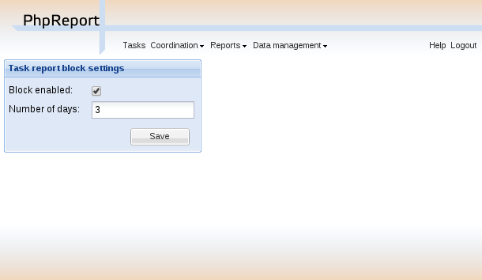

Settings management
###################

.. contents::

PhpReport provides a web interface to configure some system-wide settings.
It can be accessed from the *Data management* menu, section *Settings*.

.. figure:: i/menu-data-mgmt-settings.png

This is how the *Settings management* screen looks like:

Task report block settings
==========================

The ability for users to report their work can be blocked depending on the
date. If this feature is enabled, a number of days can be fixed so the task
reports for dates older than those days cannot be modified. It means that those
tasks cannot be modified or deleted, nor new tasks can be saved.

An example: having this feature enabled and a deadline of seven days set, we
will not be able to modify tasks reports older than one week. If it were Monday,
we wouldn't be able to add new tasks or modify those already saved on the
previous Monday or before it.

There are two settings to configure this feature:

Block enabled:
  If checked, the feature is enabled. If unchecked, it is disabled and users
  would be able to modify tasks on any date in the past.

Number of days:
  The number of days in the past to activate the block. The minimum value is 1,
  which would block the day before the current date. Setting it to 0 or leaving
  it empty would disable the feature.
