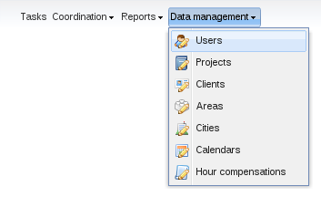
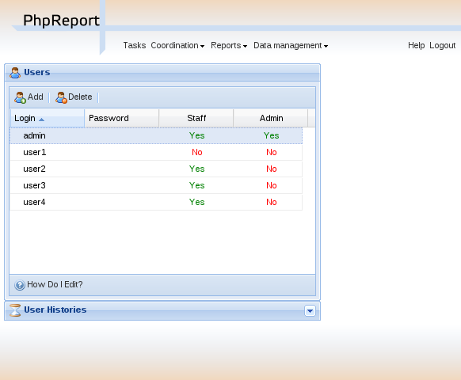
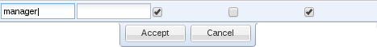
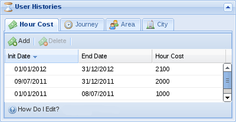
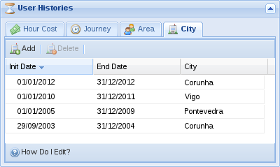

Users management
###################

.. contents::

PhpReport provides an interface to create, edit and remove users, and assign
their hour cost, journey, area membership and city residence data.
It can be accessed from the *Data management* menu, section *Users*.

Create, edit and delete users
===================================

In the *Users management* screen you will see a grid containing all the
users, sorted by *login* by default; this can be changed pressing on
the corresponding column.

To create a new user you must use the *Add* button located above the grid,
and to edit an existing user you must double-click on the corresponding row.

In both cases, the following inline edition row will appear:

In the row you must enter the data of the user:

Login:
  User name, to be used in the login screen and to appear in the reports.

Password:
  Password to be used in the login screen.

Staff:
  Belonging to the staff group. Activating it the user will be able to login,
  fill tasks in, check reports, etc.

Admin:
  Belonging to the administrators group. Activating it the user will be able to
  use the screens under *Data management* section: manage projects, users, etc.

.. TIP:: If LDAP authentication is set, you won't be able to edit these user
         data. Besides, columns *Staff* and *Admin* may not appear, and the
         names of the groups in the LDAP server would appear instead.

To delete an user you must select it with a single click on the corresponding
row and use the *Delete* button located next to *Add* button.
You will be asked for confirmation before actually
trying to delete. If the user is assigned to some project, or he has already
entered some tasks, you won't be allowed to delete it. You have to remove the
existing assignations or tasks and try the deletion later.

Setting the hour cost for a user
================================

The hour cost for a user will be used to calculate the *Total cost* for a
project, taking into account the time every user has contributed to that project.
The total cost of a project can be checked in the *Project evaluation* report.

Hour cost may vary with time, so you will have to enter an *Init date* and
*End date* for every value of hour cost in PhpReport. You can do it in the
*Users management* screen, selecting one user (doing a single click on a row)
and expanding the panel named *User Histories* located below the users grid. The
first tab in this panel corresponds to *Hour Cost*:

As you can see, every row has three values: *Init date*, *End date* and *Hour
Cost*.
To create a new row, you must use the *Add* button, and to edit a row you must
double click on it. In both cases an inline edition row will appear and you will
be able to enter the three values. Once you have entered them you can *Accept*
to save the changes. To delete a row you must select it with a single click and
use the *Delete* button.

.. WARNING:: Overlapping time periods among different rows are not allowed.

Setting the journey for a user
================================

The journey is the number of hours the person is supposed to work for every
working day. Working days in PhpReport are Monday to Friday. This value will be
used to calculate the balance of *Extra hours* for a user, as well as the
corresponding amount of *Holiday hours*. These values can be checked in the
`Accumulated hours <reports.html#accumulated-hours>`__ report.

This value may vary with time (e.g. a user may change from full time to part-time
dedication for a specific period of time), so you will have to enter an *Init date* and
*End date* for every value of user journey in PhpReport. You can do it in the
*Users management* screen, selecting one user (doing a single click on a row)
and expanding the panel named *User Histories* located below the users grid.
The second tab in this panel is *Journey*:

.. figure:: i/users-mgmt-journey.png

As you can see, every row has three values: *Init date*, *End date* and *Journey*.
To create a new row, you must use the *Add* button, and to edit a row you must
double click on it. In both cases an inline edition row will appear and you will
be able to enter the three values. Once you have entered them you can *Accept*
to save the changes. To delete a row you must select it with a single click and
use the *Delete* button.

.. WARNING:: Overlapping time periods among different rows are not allowed.

Setting the area for a user
================================

Areas are the way to translate a department structure to PhpReport; you can
assign a user to an area for a defined period of time.
Like in the previous values, you will have to enter an *Init date* and
*End date* for every value of user area in PhpReport. You can do it in the
*Users management* screen, selecting one user (doing a single click on a row)
and expanding the panel named *User Histories* located below the users grid.
The second tab in this panel is *Area*:

.. figure:: i/users-mgmt-area.png

As you can see, every row has three values: *Init date*, *End date* and *Area*.
To create a new row, you must use the *Add* button, and to edit a row you must
double click on it. In both cases an inline edition row will appear and you will
be able to enter the three values. Once you have entered them you can *Accept*
to save the changes. To delete a row you must select it with a single click and
use the *Delete* button.

.. WARNING:: Overlapping time periods among different rows are not allowed.

Setting the city for a user
================================

Finally, users may be assigned to a city. The city has influence in the working
days of users, because they translate the public holidays of every city to user
hours accountability. Public holidays work like weekends: users are not supposed
to work in those days, and when they do, the hours are accounted as extra hours.

This value may vary with time (e.g. a user moving to a work center located in
a different city), so you will have to enter an *Init date* and
*End date* for every value of user city in PhpReport. You can do it in the
*Users management* screen, selecting one user (doing a single click on a row)
and expanding the panel named *User Histories* located below the users grid.
The second tab in this panel is *City*:

As you can see, every row has three values: *Init date*, *End date* and *City*.
To create a new row, you must use the *Add* button, and to edit a row you must
double click on it. In both cases an inline edition row will appear and you will
be able to enter the three values. Once you have entered them you can *Accept*
to save the changes. To delete a row you must select it with a single click and
use the *Delete* button.

.. WARNING:: Overlapping time periods among different rows are not allowed.
